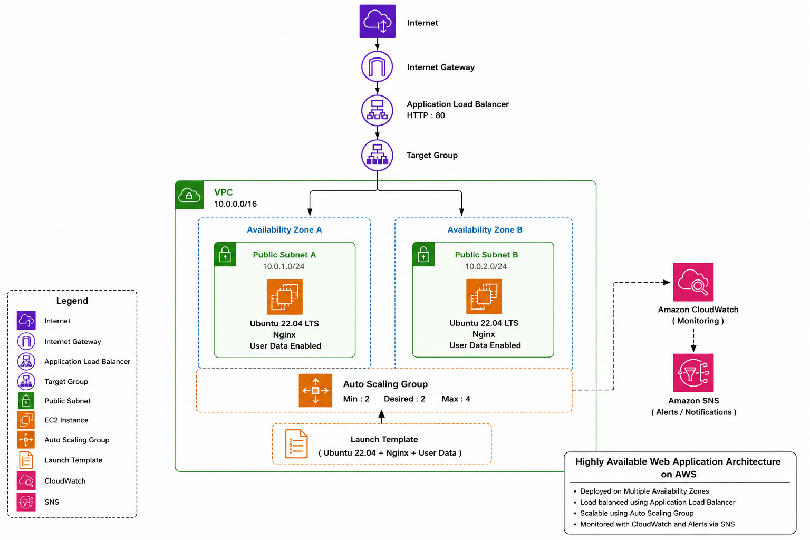

# 🚀 Highly Available AWS Infrastructure with Auto Scaling & Application Load Balancer

<p align="center">


</p>

---


# 📌 Project Overview

This project demonstrates how to build a **Highly Available**, **Fault-Tolerant**, and **Scalable AWS Infrastructure** using core AWS services such as **Application Load Balancer**, **Auto Scaling Group**, **Amazon EC2**, **CloudWatch**, and **Amazon SNS**.

The infrastructure automatically distributes incoming traffic across multiple EC2 instances, continuously monitors application health, replaces unhealthy instances without manual intervention, and scales compute resources based on workload.

The web application is deployed on **Ubuntu EC2 instances** running **Nginx**, provisioned automatically through **EC2 User Data**, making the deployment repeatable and production-oriented.

This project simulates a real-world cloud architecture commonly used for hosting scalable web applications on AWS.

---


# 🏗️ Architecture Diagram

<p align="center">



</p>

---

# ☁️ AWS Services Used

| Service | Purpose |
|----------|----------|
| Amazon EC2 | Hosts the web application |
| Application Load Balancer | Distributes incoming traffic |
| Auto Scaling Group | Automatically scales and replaces EC2 instances |
| Launch Template | Defines EC2 launch configuration |
| Amazon VPC | Provides isolated networking |
| Public Subnets | Deploy EC2 instances across Availability Zones |
| Internet Gateway | Enables internet connectivity |
| Route Tables | Routes internet traffic |
| Security Groups | Controls inbound and outbound traffic |
| CloudWatch | Monitors infrastructure health |
| Amazon SNS | Sends email notifications |
| IAM | Provides secure service permissions |

---

# 📂 Project Structure

```text
highly-available-aws-infrastructure
│
├── architecture/
│   ├── architecture-diagram.drawio
│   └── architecture-diagram.png
│
├── docs/
│   ├── architecture.md
│   ├── deployment-guide.md
│   ├── testing-validation.md
│   └── troubleshooting.md
│
├── screenshots/
│
├── scripts/
│   └── user-data.sh
│
├── README.md
├── LICENSE
└── .gitignore
```

---

# 🚀 Deployment Workflow

The infrastructure was deployed in the following sequence:

```text
Create VPC
      │
      ▼
Create Public Subnets
      │
      ▼
Attach Internet Gateway
      │
      ▼
Configure Route Table
      │
      ▼
Create Security Groups
      │
      ▼
Launch Ubuntu EC2
      │
      ▼
Configure User Data (Nginx)
      │
      ▼
Create Launch Template
      │
      ▼
Create Target Group
      │
      ▼
Create Application Load Balancer
      │
      ▼
Create Auto Scaling Group
      │
      ▼
Configure CloudWatch Alarm
      │
      ▼
Configure Amazon SNS
      │
      ▼
Validate Infrastructure
```

> 📖 **Detailed deployment steps are available in:**  
> `docs/deployment-guide.md`

---


# 💡 Challenges Faced

During implementation, several real-world deployment challenges were encountered and resolved.

- Configuring Application Load Balancer correctly
- Registering healthy targets
- Auto Scaling policy validation
- CloudWatch Alarm configuration
- User Data automation
- Instance metadata retrieval using IMDSv2
- Security Group configuration
- Target Group health check troubleshooting

Resolving these issues significantly improved understanding of AWS networking and infrastructure behavior.

> 📖 Complete troubleshooting details are available in:

```
docs/troubleshooting.md
```

---


# 📈 Key Learnings

Through this project I gained practical experience in:

- Designing Highly Available AWS Infrastructure
- Building fault-tolerant cloud architectures
- Deploying scalable applications
- Implementing Auto Scaling strategies
- Configuring Application Load Balancers
- Monitoring infrastructure using CloudWatch
- Sending operational alerts using Amazon SNS
- Automating EC2 provisioning using User Data
- Understanding production deployment workflows
- Troubleshooting real AWS infrastructure issues

---

# 🚀 Future Improvements

Potential future enhancements include:

- HTTPS using AWS Certificate Manager (ACM)
- Route 53 Domain Integration
- AWS WAF
- Terraform Infrastructure as Code
- Jenkins CI/CD Pipeline
- Docker Containerization
- Amazon ECS / Kubernetes Deployment
- CloudFront CDN
- AWS Systems Manager (SSM)
- Centralized Logging
- Infrastructure Monitoring Dashboard using Grafana
- Blue/Green Deployment Strategy

---

# 🤝 Contributing

Contributions, improvements and suggestions are welcome.

If you have ideas to improve this project, feel free to fork the repository and submit a pull request.

---


# 👨‍💻 Author

**Shivam Malik**

Cloud & DevOps Engineer

GitHub: **https://github.com/Shivam-Malik-Dev**

LinkedIn: **https://www.linkedin.com/in/shivam-malik-59b13a29b/**

---

# ⭐ Support

If you found this project helpful, consider giving it a **Star ⭐** on GitHub.

It motivates me to build and share more production-ready Cloud & DevOps projects.

---

<p align="center">

⭐ Thank you for visiting this repository! ⭐

</p>
